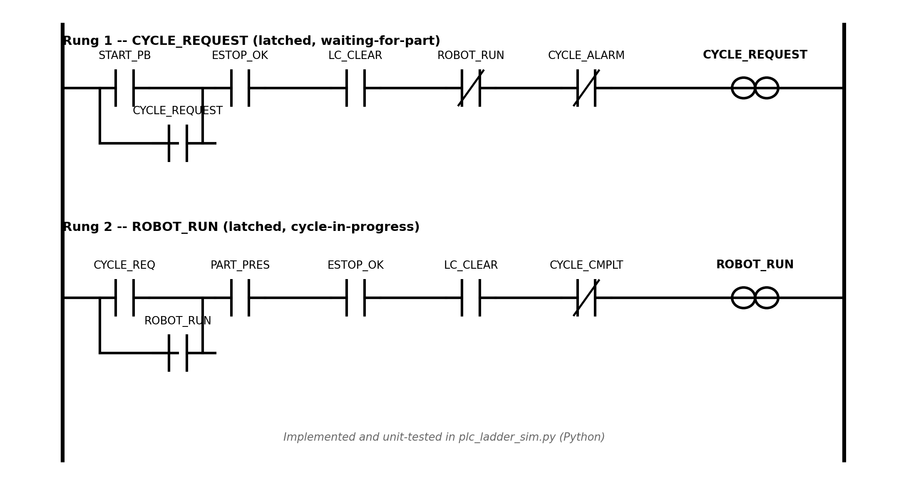

# PLC Ladder-Logic Simulator

A small Python simulator that models a PLC ladder-logic program — the
same rung / contact / coil conventions used in real Mitsubishi MELSEC FX
programming — and validates it against a set of test cases, the way
you'd check a PLC program before it ever touches a physical robot cell.

Written to turn a concept I learned on paper (ladder logic, I/O mapping,
alarm timers, during an industrial-automation internship) into
executable, testable software.

## What it models

A robot-cell start/run interlock built from two latched ladder rungs —
a `START_PB` push-button, a `PART_PRESENT` sensor, and a safety
interlock (`ESTOP_OK`, `LC_CLEAR`) deciding when a robot is allowed to
run, plus a timer-driven alarm if the part never shows up.

**Rung 1 — `CYCLE_REQUEST`** (latched, "waiting for part")

```
--| START_PB |--| ESTOP_OK |--| LC_CLEAR |--|/ROBOT_RUN|--|/CYCLE_ALARM|--( CYCLE_REQUEST )
     |                                                          |
     +-----| CYCLE_REQUEST |------(same conditions)-------------+   <- seal-in branch
```

**Rung 2 — `ROBOT_RUN`** (latched, "cycle in progress")

```
--| CYCLE_REQUEST |--| PART_PRESENT |--| ESTOP_OK |--| LC_CLEAR |--|/CYCLE_COMPLETE|--( ROBOT_RUN )
     |                                                                    |
     +-----------| ROBOT_RUN |-----(ESTOP_OK, LC_CLEAR, /CYCLE_COMPLETE)---+
```

- Pressing `START_PB` (with the safety interlock healthy) latches a
  "waiting for part" request.
- Once `PART_PRESENT` arrives, `ROBOT_RUN` latches and the cycle runs.
- `ESTOP_OK` or `LC_CLEAR` going false drops `ROBOT_RUN` immediately —
  a real safety interlock, not just a start condition.
- `CYCLE_COMPLETE` resets `ROBOT_RUN` back to idle.
- If `PART_PRESENT` never arrives, a scan-counting timer (the software
  equivalent of a **TON** — timer-on — instruction) raises a **latched**
  `CYCLE_ALARM`, which cancels the stale request.



## How it works

- `Contact` — a single NO/NC contact referencing a named bit.
- `Rung` — a list of OR'd branches, each branch a series (AND) of
  contacts — exactly how a real ladder network with a seal-in branch is
  drawn.
- `PLC` — a minimal scan-cycle engine: on every `scan()`, it merges new
  inputs, evaluates every rung in order, and updates the alarm timer.

No external dependencies — pure Python 3.7+ standard library
(`dataclasses`, `typing`).

## Running it

```bash
git clone https://github.com/AdiDev1512006/plc-ladder-logic-simulator.git
cd plc-ladder-logic-simulator
python3 plc_ladder_sim.py
```

## Test results

Ships with 9 test cases covering a normal start, delayed part arrival,
E-Stop / light-curtain trips, seal-in behaviour, cycle completion, and
the alarm-timeout scenario:

```
Test Case                                                Expected  Actual   Result
-----------------------------------------------------------------------------------
Start pressed with part present & safety OK               True      True     PASS
Start pressed, part not yet present -> request latches    True      True     PASS
Part arrives one scan after start -> robot runs           True      True     PASS
E-Stop pressed while robot is running                     False     False    PASS
Light curtain broken while robot is running               False     False    PASS
CYCLE_COMPLETE resets ROBOT_RUN                           False     False    PASS
Part sensor silent past timeout -> CYCLE_ALARM raised     True      True     PASS
Part sensor arrives within timeout -> no alarm            False     False    PASS
Request cancelled automatically after alarm fires         False     False    PASS

9/9 test cases passed.
```

## Project structure

```
plc-ladder-logic-simulator/
├── plc_ladder_sim.py     # Contact / Rung / PLC classes + test suite
├── ladder_diagram.png    # Ladder diagram of the two rungs
└── README.md
```

## Possible extensions

- A proper `TON`/`TOF` timer class instead of the hand-rolled scan counter.
- A third rung for a conveyor-index or part-reject sequence.
- A tiny CLI or Tkinter panel to flip inputs live and watch outputs react.

## Author

Aditya
